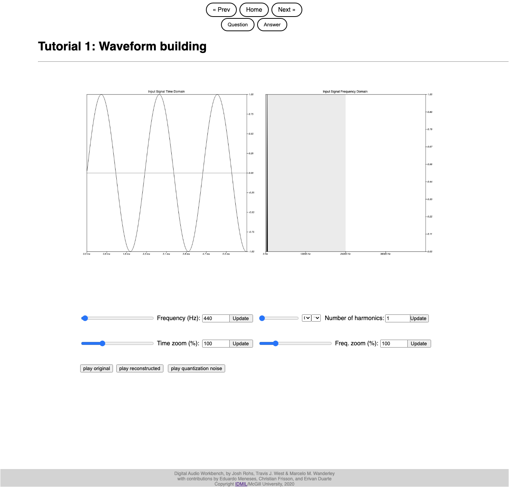
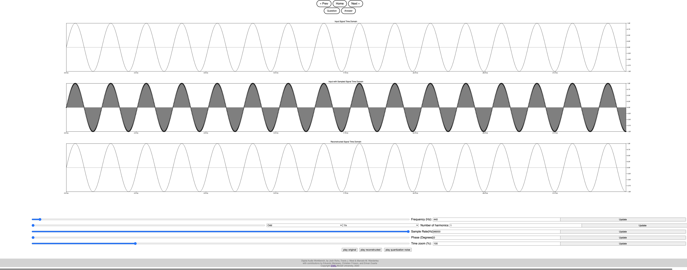

# Progress report 2

## Goal

* Create a set of progressive learning examples 
	
## What was done

* The examples were created, however review and refinement of their material is needed.
* Work done on the UI of the pages in order to create space for text 
	* 	Added margine spacing over the widgets UI including sliders and buttons
	*  Gave the page a title and description section

*Figure 1: Properly formated version*

## Challenges, Future Work and Discussion
While it works for 2 collumn spacing work must be done on the formating of the sliders and buttons on the page and a rework on how the columns are created. As it is now, it is being poorly formated when there is only one column. 

Now that a basic structure is created for the Tutorial, we can now refine what each section is, add or take away some and write out the text that will be added to it.

Another challenge is to work on having the spacing of each section be maintained as to not create overlaps at certain aspect ratios.

*Figure 2: Badly formated version* 

In this figure we see the the issues that needs to be corrected. First of all, the sliders columne position is linked to that of the graphs. So if the slides are in a singular collumn, so will the slider be.

Next, is the spacing of the sliders elements need to be better. Also just creating a better structure of the page can improve the reception of the project and make it look more profesionnal if desired.

